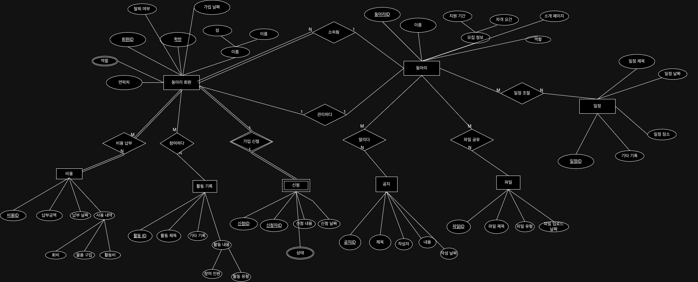
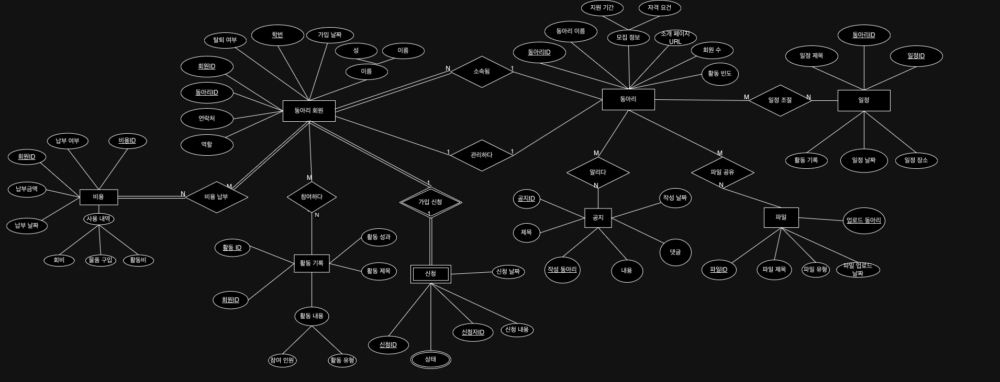

# ER Diagram Docs

## ER 다이어그램 변화 과정

### 2024년 11월 20일 - V1.

- ER 다이어그램은 프로젝트 초기 단계의 데이터 구조를 나타낸다.

- 한계점
     - 그림의 선들이 겹치는 경우도 있고 각 관계를 다시 파악할 필요가 있다.
- 추후
     - `Relation Schema`의 단계는 `ER 다이어그램` 단계가 잘 그려져야 된다고 생각함.
     - 따라서 요구사항의 지속적 변경과 `ER 다이어그램의 수정 및 보안`을 할 예정
     
### 2024년 12월 09일 - V2.

- [요구사항 수정 및 변경](요구사항.md)
- 그 따른 Diagram의 Entity를 변경
- 가시적으로 관계들이 더 잘보이게 수정
- 한계점
     - Entity가 많기 때문에 관계 확인이 몇차례에 걸쳐 필요
- 추후
     - 이 관계를 바탕으로 `Relation Schema`를 도출 할 예정

     
### 2024년 12월 12일 - V3.

- [요구사항 수정 및 변경](요구사항.md)
- 그 따른 Diagram의 Entity를 변경